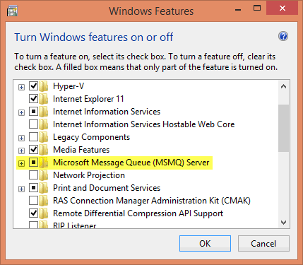

Manufacturing.DataPusher
=======================

A framework for pushing data to Azure. The source location could be a local Windows message queue, a local service bus queue, SQL Server, a file system, or any other source using the adapter pattern. The included and default adapters read from a local MS Message Queue and push to a service bus queue.

Sources implement `ILocalRecordRepository`, and the destinations implement `IDataPusher`. Modify the `DataPusherContainer` to change the implementations that get used. By default, [auto-registration](http://structuremap.github.io/registration/auto-registration-and-conventions/) is used.

By default, data is pulled from a local MSMQ, which can be clustered for high availability. The default transport is [Azure Event Hubs](http://azure.microsoft.com/en-us/services/event-hubs/) due to the extremely high ingestion rate.

## Prerequisites

* Since data is pulled from a local MSMQ by default, you'll need to have this Windows feature installed. Fortunately, it's available in all editions of Windows. Turn it on in *Add/Remove Programs* under *Windows Features*.

# License

Microsoft Developer Experience & Evangelism

Copyright (c) Microsoft Corporation. All rights reserved.

THIS CODE AND INFORMATION ARE PROVIDED "AS IS" WITHOUT WARRANTY OF ANY KIND, EITHER EXPRESSED OR IMPLIED, INCLUDING BUT NOT LIMITED TO THE IMPLIED WARRANTIES OF MERCHANTABILITY AND/OR FITNESS FOR A PARTICULAR PURPOSE.

The example companies, organizations, products, domain names, e-mail addresses, logos, people, places, and events depicted herein are fictitious. No association with any real company, organization, product, domain name, email address, logo, person, places, or events is intended or should be inferred.
